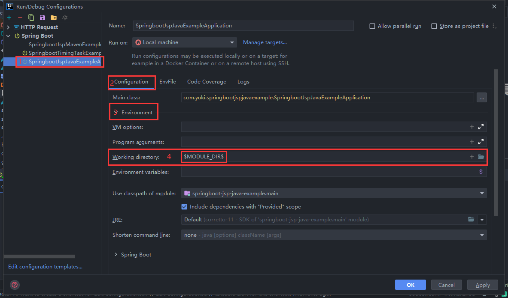

# 使用 Idea Module 实现 SpringBoot 集成 JSP

## 步骤

1. 添加依赖

maven

```xml
<dependency>
    <groupId>org.apache.tomcat.embed</groupId>
    <artifactId>tomcat-embed-jasper</artifactId>
</dependency>
```

gradle(kotlin)

```kotlin
implementation("org.apache.tomcat.embed:tomcat-embed-jasper")
```

gradle(groovy)
```groovy
implementation 'org.apache.tomcat.embed:tomcat-embed-jasper'
```

2. 配置 application.properties

```properties
spring.mvc.view.prefix=/WEB-INF/pages/
spring.mvc.view.suffix=.jsp

# 输出日志信息
logging.level.org.apache.jasper.servlet.JspServlet=debug
```

3. 创建页面

按照如下目录结构创建文件夹(主要是创建 **webapp** 及其子目录)

```text
src
├─main
│  ├─java
│  ├─resources
│  └─webapp
│      └─WEB-INF
│          └─pages
```

在 pages 下创建 hello.jsp 文件

```html
<%--
  Created by IntelliJ IDEA.
  User: 27812
  Date: 2021/6/8
  Time: 17:12
  To change this template use File | Settings | File Templates.
--%>
<%@ page contentType="text/html;charset=UTF-8" language="java" %>
<html>
<head>
    <title>Title</title>
</head>
<body>

</body>
</html>
```

4. 创建控制器

```java
package com.yuki.springbootjspjavaexample.controller;

import org.springframework.stereotype.Controller;
import org.springframework.web.bind.annotation.RequestMapping;

@Controller
public class HelloController {

    @RequestMapping("/hello")
    public String hello() {
        return "hello";
    }
}
```

5. 运行代码，访问 http://localhost:8080/hello , 控制台输出结果

```log

```

## 问题

### 问题一：使用模块的信息配置 JSP，总是找不到 JSP 文件

### 解决方法：

Run -> Edit Configurations -> Configuration -> Environment -> Working Directory -> 选择 + -> 选择 $MODULE_DIR$


